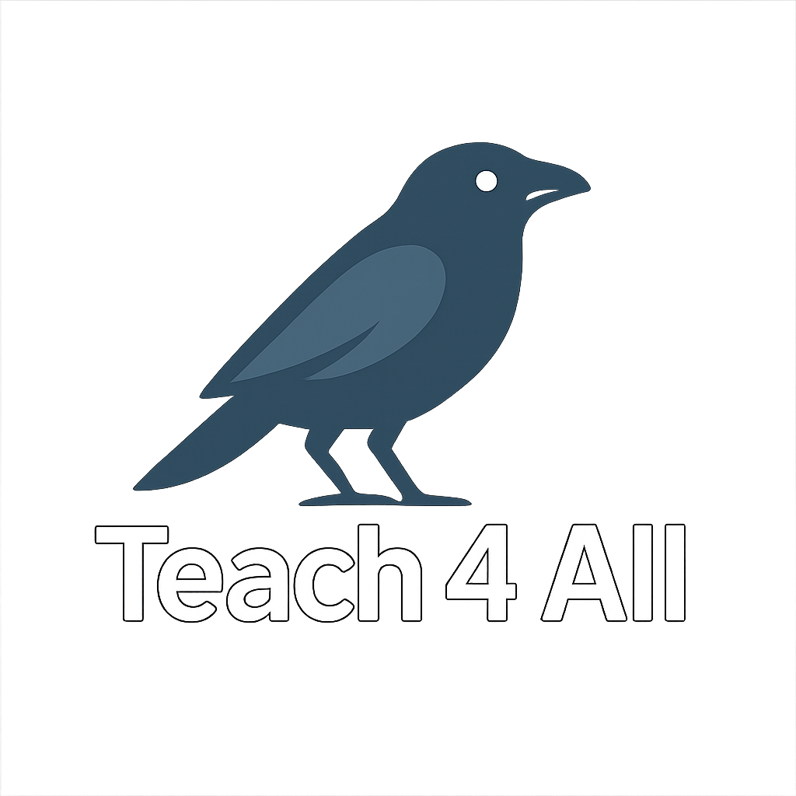

# Teach 4 All
Use Dark Mode for Optimal Experience

# Demo Video

## Demo Video

Click image above to view demo video

Teach 4 All is a free open-source teaching tool for teachers and students to share lectures,
quizzes, and information on various subjects. Teachers can upload courses to be viewed by 
students. Students can access a course they want to view with the search bar.
## Features

- User‑contributed courses  
- Built‑in quiz creation and auto‑grading  
- Progress tracking and badges

## Getting Started

1. Connect to CPP wifi Eduroam
2. Address to be given to judges at presentation
3. You're ready to go!

## Features to be added

- Account logins
- Video Lecture uploads

## Search function

